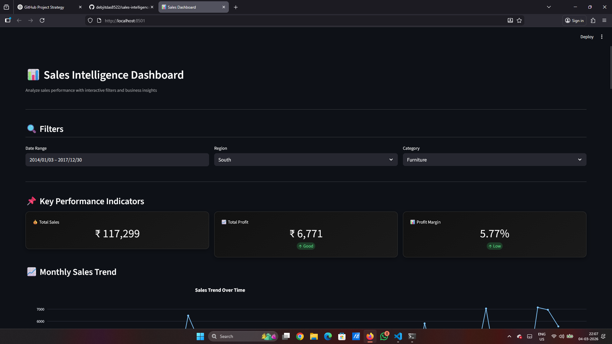
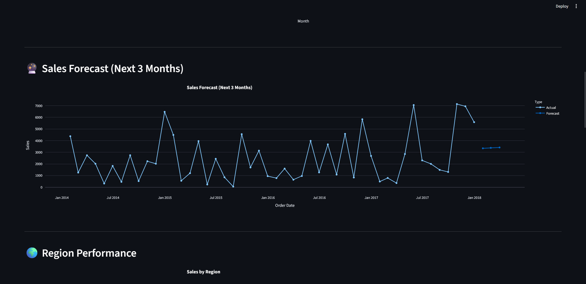
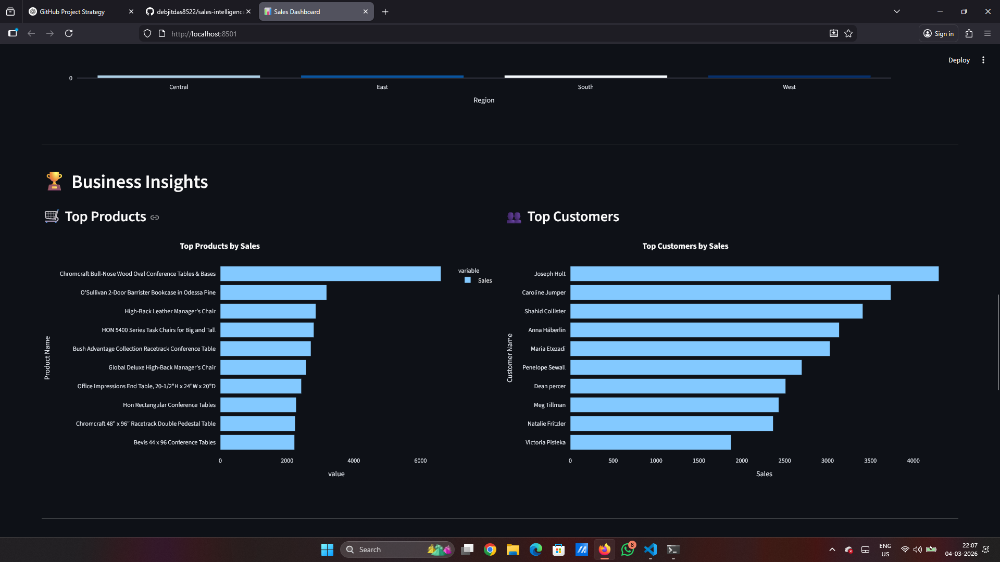

# 📊 Sales Intelligence Dashboard


An interactive **Business Intelligence dashboard** built using **Python, Streamlit, and Plotly** to analyze sales performance, monitor key metrics, and generate actionable business insights.

---

## 🚀 Live Demo

[](https://sales-intelligence-dashboard-huwex4x8wg2pmch2osrypk.streamlit.app)

Try the deployed application here:  
https://sales-intelligence-dashboard-huwex4x8wg2pmch2osrypk.streamlit.app

---

## 📸 Dashboard Preview

### Dashboard Overview


### Sales Forecast


### Business Insights


---

## 🚀 Features

- 📊 **KPI Metrics**
  - Total Sales
  - Total Profit
  - Profit Margin

- 📈 **Monthly Sales Trend**
  - Interactive time-series visualization

- 🔮 **Sales Forecast**
  - Predict next 3 months of sales

- 🌍 **Region Performance**
  - Compare sales across regions

- 🧠 **AI-Generated Business Insights**
  - Highest revenue region
  - Most profitable category
  - Loss-making sub-categories

- 🏆 **Top Products**
  - Identify best-performing products

- 👥 **Top Customers**
  - View customers generating highest revenue

- 📉 **Profit Analysis**
  - Profit / loss by sub-category

- 📥 **Data Export**
  - Download filtered data as CSV

---

## 🛠 Tech Stack

| Tool | Purpose |
|-----|------|
| Python | Programming Language |
| Pandas | Data Analysis |
| SQLite | Data Storage |
| Streamlit | Dashboard Framework |
| Plotly | Interactive Visualizations |

---

## 📂 Project Structure

```
sales-intelligence-dashboard
│
├── assets
│   ├── dashboard_overview.png
│   ├── sales_forecast.png
│   └── business_insights.png
│
├── charts
│   ├── monthly_sales.py
│   └── region_sales.py
│
├── data
│   └── superstore.csv
│
├── database
│   └── sales.db
│
├── utils
│   └── load_data.py
│
├── app.py
├── create_database.py
├── requirements.txt
└── README.md
```

---

## 📊 Dataset

**Superstore Sales Dataset (2014–2017)**

Includes:

- Orders
- Products
- Customers
- Regions
- Sales
- Profit

---

## ▶️ Run the Project

### 1️⃣ Clone the repository

```
git clone https://github.com/debjitdas8522/sales-intelligence-dashboard.git
cd sales-intelligence-dashboard
```

### 2️⃣ Install dependencies

```
pip install -r requirements.txt
```

### 3️⃣ Create the database

```
python create_database.py
```

### 4️⃣ Run the dashboard

```
streamlit run app.py
```

---

## 👨‍💻 Author

**Debjit Das**

If you like this project, consider giving it a ⭐ on GitHub.
